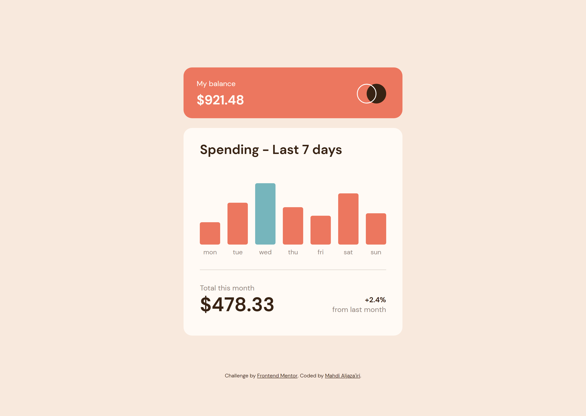

# Frontend Mentor - Expenses chart component solution

This is a solution to the [Expenses chart component challenge on Frontend Mentor](https://www.frontendmentor.io/challenges/expenses-chart-component-e7yJBUdjwt).  
Frontend Mentor challenges help you improve your coding skills by building realistic projects. 

\*Me\* : I agree 👍

&& SOME ICONS && (👍😐🙂)

## Table of contents

- [Overview](#overview)
  - [The challenge](#the-challenge)
  - [Screenshot](#screenshot)
  - [Links](#links)
- [My process](#my-process)
  - [What I learned](#what-i-learned)
  - [Continued development](#continued-development)
  - [Note](#note)
- [Tools](#tools)
- [Author](#author)

## Overview

### The challenge

Users should be able to:

- View the bar chart and hover over the individual bars to see the correct amounts for each day
- See the current day’s bar highlighted in a different colour to the other bars
- View the optimal layout for the content depending on their device’s screen size
- See hover states for all interactive elements on the page
- **Bonus**: Use the JSON data file provided to dynamically size the bars on the chart

### Screenshot

### Links

- Solution URL: <https://your-solution-url.com>
- Live Site URL: <https://your-live-site-url.com>

## My process

### What I learned

I'm now comfortable with working with `XMLHttpRequest` objects. Although I would prefer loading all the necessary data via the server itself instead.

Also, using Sass for this project was a perfect decision, and nesting saved me a lot of headache. You can look up and compare "`main.scss`" and "`style.css`" to see the difference yourself. Especially rules nested inside `#chart`. I did make plenty of changes to those rules and switched their places a couple of times. Imagine doing all of this in pure CSS. What a pain!

### Continued development

I got to get a handle on Fetch API. Plus getting introduced to back-end stuff as well.

### Note

You might have noticed that I have a "`sass`" folder, inside of which sits a "`main.scss`" file. This is not a typo. The word **Sass** refers to the language at entirety. Sass was originally written in *Indented syntax*, and the extension for these files was "`*.sass`". It was later that they introduced the *Sassy CSS* syntax or *SCSS* whose extention was "`*.scss`".

So the "`sass`" folder is for all Sass files either written in Indented or SCSS syntax.

## Tools

- [Dev Docs](https://devdocs.io) - The resource I was referring to throughout the process. It's an offline web app that has a huge collection of documentations.
- [Brackets](https://brackets.io) - My text editor. Not as powerful as VSCode, but still my favorite.
- Chrome - This web page was only tested on Chrome. 

## Author

- GitHub - [Mahdi Aljaza'iri](https://github.com/MahdiAljazairi)
- Frontend Mentor - [@MahdiAljazairi](https://www.frontendmentor.io/profile/MahdiAljazairi)
